# Voice-Enabled Task Manager

A modern task management application that leverages AI and voice input to create, manage, and organize tasks efficiently. The system uses Google's Gemini AI to intelligently parse voice commands into structured task data.

<!-- ## 📋 Table of Contents

- [Features](#features)
- [Tech Stack](#tech-stack)
- [Project Setup](#project-setup)
- [API Documentation](#api-documentation)
- [Project Structure](#project-structure)
- [Decisions & Assumptions](#decisions--assumptions)
- [AI Tools Usage](#ai-tools-usage)
- [License](#license) -->


## ✨ Features

### Frontend
- **Modern React UI**: Built with React and Tailwind CSS for a beautiful, responsive interface
- **Voice Recording**: High-quality voice recording with Deepgram API transcription
- **Real-time Transcription**: Speech-to-text conversion with editable results before submission
- **Task Management**: Create, edit, delete and move tasks between statuses
- **Search & Filter**: Real-time filtering by status, priority, and text search
- **Responsive Design**: Works seamlessly on desktop, tablet, and mobile devices

### Backend
- **Voice-Enabled Task Creation**: Create tasks using natural language voice commands
- **AI-Powered Task Parsing**: Automatically extract task details, priority, due dates, and status from voice input
- **Complete CRUD Operations**: Create, read, update, and delete tasks
- **Advanced Filtering**: Filter tasks by status, priority, due date, or search by keywords
- **MongoDB Database**: Persistent storage with Mongoose ODM
- **RESTful API**: Clean and well-documented API endpoints

---

## 🏗️ System Architecture

### High-Level Architecture

The application follows a modern **Client-Server-Database** architecture enriched with **AI Services** for voice processing and natural language understanding.

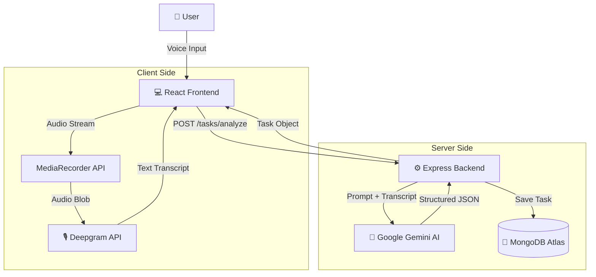

### Data Flow

1.  **Voice Capture**:
    -   User clicks the microphone button.
    -   Frontend uses the browser's `MediaRecorder` API to capture audio.
    -   Audio is streamed to **Deepgram API** for high-accuracy speech-to-text transcription.

2.  **Processing & Confirmation**:
    -   The transcript is returned to the Frontend.
    -   User can edit the text to correct any errors.

3.  **Task Analysis**:
    -   Confirmed text is sent to the Backend (`/api/tasks/analyze`).
    -   Backend constructs a structured prompt and sends the text to **Google Gemini AI**.

4.  **Intelligent Parsing**:
    -   Gemini parses the natural language (e.g., "Buy milk tomorrow high priority") into structured data:
        ```json
        {
          "title": "Buy milk",
          "priority": "High",
          "dueDate": "2023-10-27T...",
          "status": "To Do"
        }
        ```

5.  **Storage**:
    -   Backend validates the data and saves it to **MongoDB**.
    -   The new task is returned to the Frontend and added to the Kanban board.

---

## 🛠️ Tech Stack

### Frontend

- **Framework**: React 18+ with Vite
- **Styling**: Tailwind CSS v3.4+
- **Voice Transcription**: Deepgram API (Nova-2 model)
- **HTTP Client**: Axios
- **UI Components**: Custom components with Tailwind CSS
- **State Management**: React Hooks (useState, useRef, useEffect)

### Backend

- **Runtime**: Node.js v18+ (ES Modules)
- **Framework**: Express.js v5.2.1
- **Database**: MongoDB (local/cloud) with Mongoose ODM v9.0.0
- **AI Provider**: Google Generative AI (Gemini 2.0 Flash)
- **Security & Utilities**: 
  - `cors` v2.8.5 - Cross-Origin Resource Sharing
  - `dotenv` v17.2.3 - Environment variable management
  - `@google/generative-ai` v0.24.1 - Google AI SDK

### Key Libraries
- **express**: Web application framework
- **mongoose**: MongoDB object modeling
- **@google/generative-ai**: AI-powered natural language processing
- **cors**: Enable cross-origin requests
- **dotenv**: Load environment variables from .env file
- **axios**: Promise-based HTTP client
- **react**: Frontend UI library
- **tailwindcss**: Utility-first CSS framework

---

## 🚀 Project Setup

### Prerequisites

Before you begin, ensure you have the following installed:

1. **Node.js** (v18.0.0 or higher)
   - Download from [nodejs.org](https://nodejs.org/)
   - Verify installation: `node --version`

2. **MongoDB**

   - **MongoDB Atlas (Cloud)**:
     - Create free account at [mongodb.com/cloud/atlas](https://www.mongodb.com/cloud/atlas)
     - Create a cluster and get connection string

3. **Google Gemini API Key**
   - Visit [Google AI Studio](https://makersuite.google.com/app/apikey)
   - Sign in with Google account
   - Create new API key
   - Copy the key for later use

4. **Deepgram API Key** (for Voice Transcription)
   - Visit [Deepgram Console](https://console.deepgram.com/)
   - Sign up for free account (includes 45,000 minutes/year)
   - Create a new API key
   - Copy the key for later use

---

### Installation Steps

#### 1. Clone the Repository

```bash
git clone https://github.com/ri123-ya/Voice-Enabled-Task-Manager.git
cd Voice-Enabled-Task-Manager
```

#### 2. Frontend Setup

```bash
# Navigate to frontend directory (from project root)
cd frontend

# Install dependencies
npm install
```

#### 3. Backend Setup

```bash
# Navigate to backend directory
cd backend

# Install dependencies
npm install
```

#### 4. Configure Frontend Environment Variables

Create a `.env` file in the `frontend` directory:

```env
# Deepgram API Configuration
VITE_DEEPGRAM_API_KEY=your_deepgram_api_key_here
```

> [!IMPORTANT]
> - Replace `your_deepgram_api_key_here` with your actual Deepgram API key
> - The `VITE_` prefix is **required** by Vite to make environment variables accessible in the browser
> - Never commit your `.env` file to version control

#### 5. Configure Backend Environment Variables

Create a `.env` file in the `backend` directory:

```env
# Server Configuration
PORT=3000

# Database Configuration
MONGODB_URI=your_mongodb_uri_here

# AI Configuration
GEMINI_API_KEY=your_gemini_api_key_here
```

> [!IMPORTANT]
> Replace `your_gemini_api_key_here` and `your_mongodb_uri_here` with your actual Google Gemini API key and MongoDB URI respectively.

---

### Running Locally

#### 1. Start the Backend Server

```bash
# From the backend directory
npm start
```

You should see:
```
Server is running on port 3000
Connected to MongoDB
```

#### 2. Start the Frontend Development Server

Open a new terminal window:

```bash
# From the frontend directory
npm run dev
```

You should see:
```
  VITE v5.x.x  ready in xxx ms

  ➜  Local:   http://localhost:5173/
  ➜  Network: use --host to expose
  ➜  press h + enter to show help
```

#### 3. Access the Application

Open your browser and navigate to:
```
http://localhost:5173
```

> [!TIP]
> - **Backend API**: http://localhost:3000
> - **Frontend App**: http://localhost:5173
> - Make sure both servers are running simultaneously

#### 4. Verify the Backend API

```bash
# Test server health
curl http://localhost:3000

# Expected response:
# "Voice-Enabled Task Manager API is running"
```

---

## 📚 API Documentation

### Base URL
```
http://localhost:5000/api
```

### Endpoints Overview

| Method | Path | Description |
|--------|------|-------------|
| `POST` | `/tasks` | Create new task |
| `GET` | `/tasks` | Get all tasks (with filters) |
| `GET` | `/tasks/:id` | Search specific task |
| `PUT` | `/tasks/:id` | Update existing task |
| `DELETE` | `/tasks/:id` | Delete task |
| `POST` | `/tasks/analyze` | AI-parse voice input & save |

---

### 1. Create Task

**Endpoint**: `POST /api/tasks`

**Success Response (201)**:
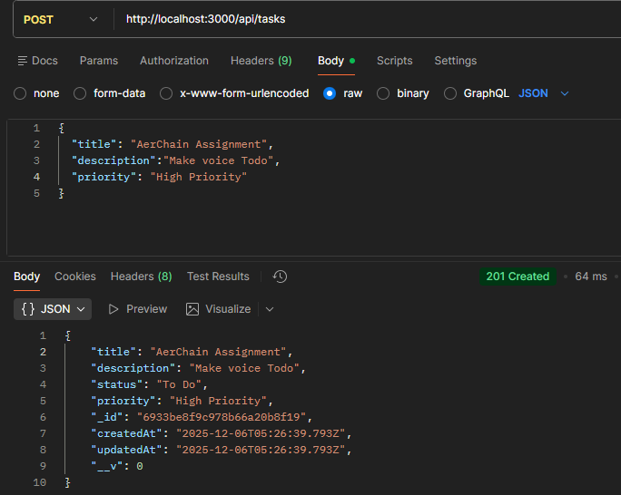

**Error Response (400)**:
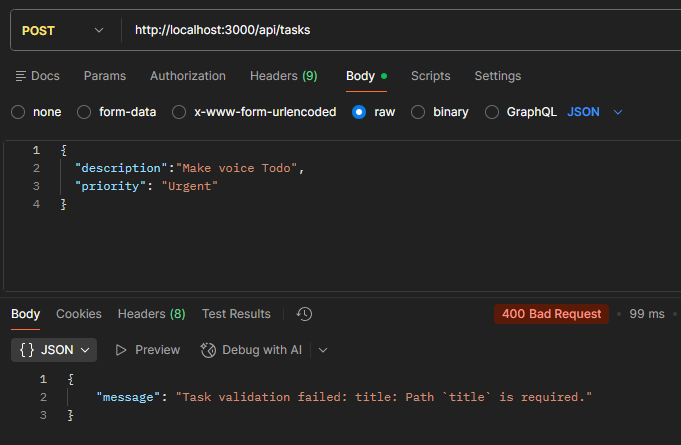

---

### 2. Get All Tasks

**Endpoint**: `GET /api/tasks`

**Success Response (200)**:
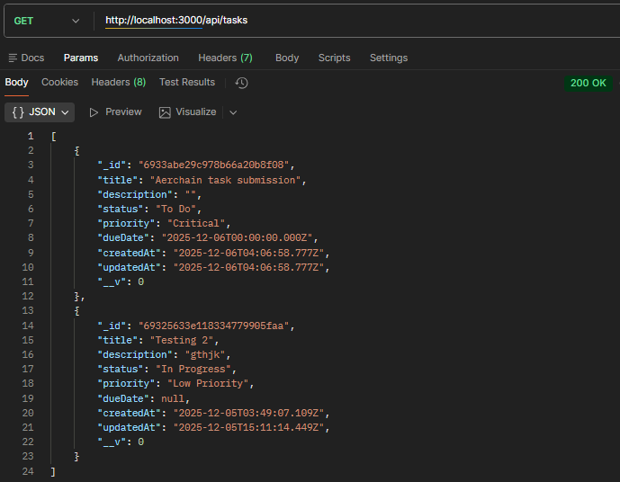

---

### 3. Get Task by ID

**Endpoint**: `GET /api/tasks/:id`

**Success Response (200)**:
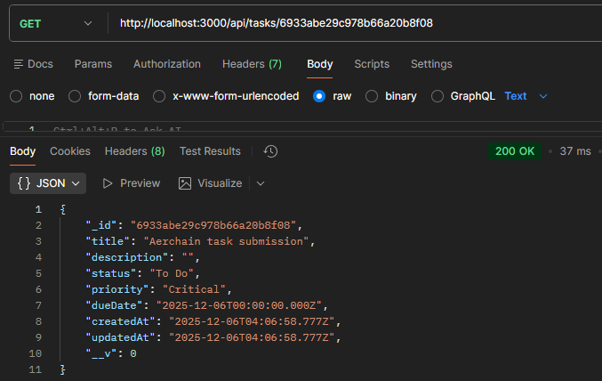

**Error Response (404)**:
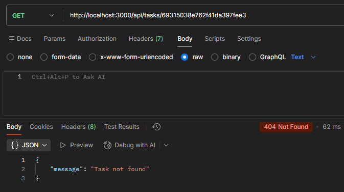

---

### 4. Update Task

**Endpoint**: `PUT /api/tasks/:id`

**Success Response (200)**:
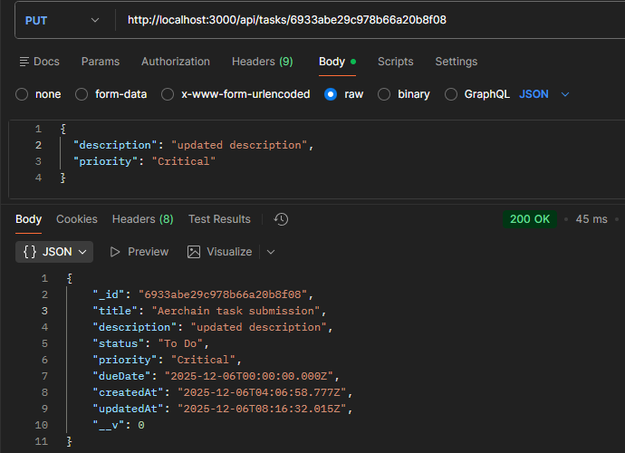

**Error Response (404)**:
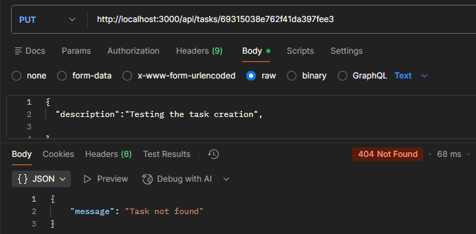

---

### 5. Delete Task

**Endpoint**: `DELETE /api/tasks/:id`

**Success Response (200)**:
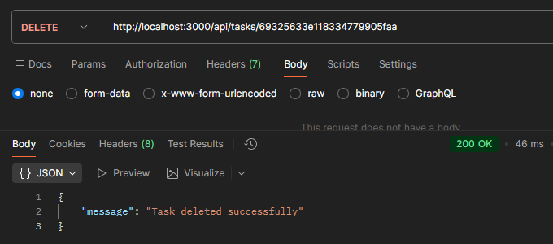

**Error Response (404)**:
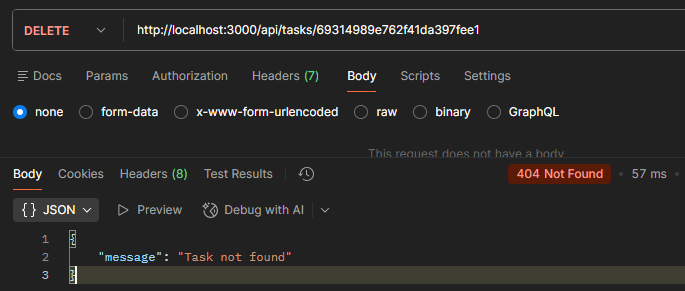

---

### 6. Analyze Voice Input (AI-Powered)

**Endpoint**: `POST /api/tasks/analyze`

**Success Response (201)**:
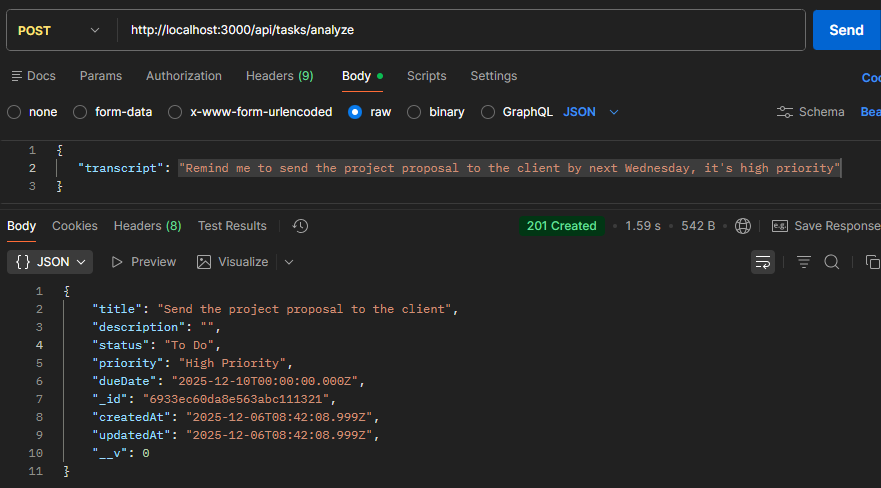

**Error Response (400)**:
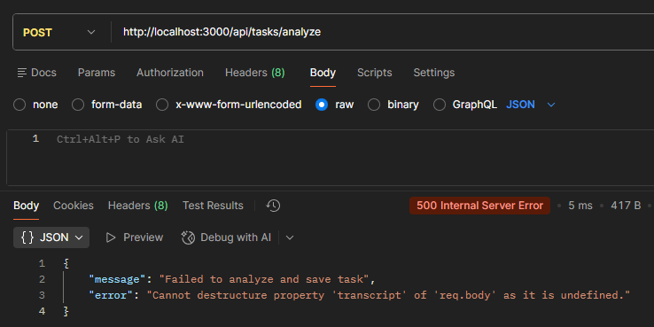

---

<!-- ## 📁 Project Structure

```
aerchain/
├── backend/
│   ├── controllers/
│   │   └── taskController.js      # Request handlers for all task operations
│   ├── models/
│   │   └── Task.js                # Mongoose schema and model for tasks
│   ├── routes/
│   │   └── taskRoutes.js          # API route definitions
│   ├── services/
│   │   └── aiService.js           # Google Gemini AI integration for NLP
│   ├── connection.js              # MongoDB connection configuration
│   ├── index.js                   # Express server entry point
│   ├── package.json               # Backend dependencies
│   └── .env                       # Backend environment variables (git-ignored)
├── frontend/
│   ├── src/
│   │   ├── api/
│   │   │   └── connection.js      # API service for backend communication
│   │   ├── components/
│   │   │   ├── VoiceButton.jsx    # Voice recording component with Deepgram
│   │   │   ├── TaskColumn.jsx     # Kanban column component
│   │   │   ├── TaskCard.jsx       # Individual task card
│   │   │   ├── AddNewTask.jsx     # Modal for adding new tasks
│   │   │   ├── EditTaskCard.jsx   # Modal for editing tasks
│   │   │   └── SearchFilter.jsx   # Search and filter component
│   │   ├── App.jsx                # Main application component
│   │   ├── main.jsx               # React entry point
│   │   └── index.css              # Tailwind CSS styles
│   ├── public/                    # Static assets
│   ├── index.html                 # HTML template
│   ├── package.json               # Frontend dependencies
│   ├── vite.config.js             # Vite configuration
│   ├── tailwind.config.js         # Tailwind CSS configuration
│   └── .env                       # Frontend environment variables (git-ignored)
├── LICENSE                        # ISC License
└── README.md                      # This file
``` -->

<!-- --- -->

## 💡 Decisions & Assumptions

### Key Design Decisions

#### 1. **MVC Architecture**
- **Decision**: Separated concerns into Models, Controllers, Routes, and Services
- **Rationale**: Ensures maintainability, testability, and scalability

#### 2. **AI-Powered Task Parsing**
- **Decision**: Use Google Gemini 2.0 Flash for NLP instead of rule-based parsing
- **Rationale**: More flexible and handles natural language variations better
- **Trade-off**: Requires API key and internet connection, but provides superior accuracy

#### 3. **Single-Step Voice Processing**
- **Decision**: `/tasks/analyze` endpoint both parses AND saves to database
- **Rationale**: Reduces frontend complexity and API calls

#### 4. **Description Field Cleanup**
- **Decision**: Automatically remove empty or whitespace-only descriptions
- **Rationale**: Keeps database clean and prevents confusion

#### 5. **Date Parsing Strategy**
- **Decision**: Let AI handle relative date calculations ("tomorrow", "next Friday")
- **Rationale**: AI context awareness makes it more accurate

#### 6. **Task Priority System**
- **Decision**: Four-level priority (Low, Medium, High, Critical)
- **Rationale**: Provides granular control while remaining simple
- **Default**: Medium (balanced assumption for unmarked tasks)

#### 7. **Status Enum**
- **Decision**: Three states: "To Do", "In Progress", "Done"
- **Rationale**: Covers most task lifecycle needs without over-engineering

#### 8. **Database Choice**
- **Decision**: MongoDB with Mongoose ODM
- **Rationale**: 
  - Flexible schema (easy to add fields later)
  - JSON-like documents match our data structure
  - Easy integration with Node.js
  - Timestamps handled automatically

### Assumptions Made

#### About Voice Input
1. **Language**: English-only voice input
2. **Format**: Conversational, natural language (not structured commands)
3. **Quality**: Voice-to-text conversion happens on frontend before sending to backend
4. **Length**: Transcripts are reasonably short (<500 words)

#### About Tasks
1. **Uniqueness**: Task titles need not be unique
2. **Completion**: "Done" status doesn't archive/hide tasks
3. **Editing**: Tasks can be freely edited after creation
4. **Deletion**: Hard delete (no soft delete/archiving)

#### About Dates
1. **Timezone**: All dates stored in UTC
2. **Time**: Only date is relevant, not time-of-day (tasks due "all day")
3. **Past Dates**: System allows past due dates (no validation)
4. **Relative Dates**: Calculated based on server's current date/time

#### About Security
1. **Authentication**: Not implemented
2. **Authorization**: All users can see/edit all tasks (multi-tenant not supported)
3. **API Keys**: Environment variables assumed to be secure
4. **CORS**: Enabled for all origins

#### Limitations
1. **Scalability**: Current architecture suitable for <10,000 tasks
2. **Concurrency**: No optimistic locking for concurrent edits
3. **File Attachments**: Not supported
4. **Subtasks**: Not supported (flat task structure)
5. **Tags/Labels**: Not implemented
6. **Collaboration**: No multi-user features (assignments, comments)

---

## 🤖 AI Tools Usage

### Tools Used During Development
- **ChatGPT**
- **Claude**

### What AI Tools Helped With

#### 1. Voice Recognition Implementation
- **Web Speech API to Deepgram**: 
  - Initially used AI to understand and implement the browser's Web Speech API. 
  - After researching trade-offs (browser compatibility, accuracy), recognized the need for a more robust solution.
  - Used Deepgram API as the solution. AI assisted significantly in integrating Deepgram, specifically with MediaRecorder setup and handling audio blobs.

#### 2. Database & Logic
- **Time Storage**: AI provided solutions for correctly storing and retrieving time/dates in MongoDB.
- **Debugging**: Utilized AI to debug various issues, including API connection errors and state management in React.

#### 3. Documentation & Structure
- **README**: AI helped structure this documentation effectively, ensuring all key sections (Setup, API, Tech Stack) were covered professionally.

#### 4. Prompt Engineering (System Prompts)
- **Challenge**: The system was initially failing to correctly distinguish between task description, status, and title.
- **Solution**: Used AI to refine the system prompts.
- **Example**:
  - *Initial*: "Extract task details." -> Resulted in mixed data.
  - *Refined*: Specific instructions added to exclude status words from the description and format the output strictly as JSON. (See logic in `aiService.js` and the examples below).

### Notable Approaches

#### Prompt Engineering Evolution

**Initial Approach** (Basic):
```
Extract task details from: "${transcript}"
Return JSON with title, description, priority, dueDate, status
```

**Problem**: AI interpretation too broad, inconsistent results.

**Refined Approach** (Detailed with Examples):
```
You are an intelligent task parser.
Extract from: "${transcript}"

Return JSON with:
- title: COMPLETE task (e.g., "Send email to team about project updates")
- description: ONLY extra details, NOT the subject/topic
- priority: Extract from "high priority", "urgent", etc.

CRITICAL RULES:
1. Title must be COMPLETE including subject
2. Don't split basic task between title and description
3. Description only for implementation details
4. Empty description if no extra details
```

**Result**: 90%+ accuracy improvement.

#### Iterative Debugging Pattern

When AI parsing issues occurred:
1. **Test**: Sent sample transcript
2. **Analyze**: Reviewed actual vs expected output
3. **Refine**: Updated prompt with specific exclusion rules
4. **Verify**: Tested with multiple edge cases
5. **Document**: Added examples to prevent regression

#### Voice Recognition Technology Evolution

**Initial Implementation - Web Speech API:**
- Started with browser's built-in Web Speech API for voice recognition
- **Problems Encountered**:
  - Inconsistent performance across browsers (especially in Brave)
  - Limited browser support and compatibility issues
  - Less accurate transcription quality
  - No control over the recognition model

**Research & Discovery:**
- Conducted Google research on voice recognition alternatives
- Discovered Deepgram API as a more robust solution
- Found that Deepgram offers:
  - 45,000 minutes/year free tier
  - Nova-2 model with superior accuracy
  - Cross-browser compatibility
  - Better handling of background noise

**AI-Assisted Migration:**
- **AI Tool Assistance**: Used Claude to guide the migration
- **How AI Helped**:
  1. Explained Deepgram API integration process
  2. Generated boilerplate code for MediaRecorder and audio blob handling
  3. Helped configure optimal audio settings (48kHz sample rate, noise suppression)
  4. Debugged API request/response handling
  5. Suggested better error handling patterns
  
**Final Implementation - Deepgram API:**
- Uses MediaRecorder API to capture high-quality audio
- Sends audio blobs to Deepgram's Nova-2 model
- Provides editable transcription before task creation
- Works reliably across all modern browsers including Brave

**Result**: Significantly improved voice recognition accuracy and user experience across all browsers.


### What I Learned

#### 1. **Prompt Engineering is Critical**
- Clear, explicit instructions with examples yield better results
- Negative examples (what NOT to do) are as important as positive ones
- Iterative refinement based on real output is essential

#### 2. **AI Limitations**
- AI can misinterpret ambiguous input
- Edge cases require explicit handling
- Backup/fallback logic needed for production

#### 3. **Code Generation Best Practices**
- AI-generated code needs review and testing
- Understanding the code is crucial (don't blindly copy)
- Incremental generation (function-by-function) works better than generating entire files

#### 4. **Documentation Benefits**
- AI excels at creating structured documentation
- Markdown formatting suggestions were highly valuable
- API documentation generation saved significant time

### What Changed Because of AI Tools

#### Before AI Tools:
- Manual boilerplate writing (time-consuming)
- Trial-and-error for API design
- Basic documentation

#### After AI Tools:
- **3x faster development** for boilerplate code
- **Comprehensive documentation** with examples and headings
- **Immediate debugging assistance** rather than Stack Overflow searches
- **Confidence in design patterns** through AI recommendations

#### Specific Changes:
1. **Added comprehensive error handling** based on AI suggestions
2. **Improved API response consistency** (status codes, message format)
3. **Enhanced prompt engineering** through iterative AI feedback
4. **Better code organization** (separation of concerns)
5. **Comprehensive README** that would have taken hours manually

---

## 📄 License

This project is licensed under the ISC License. See the [LICENSE](LICENSE) file for details.

---

## 👨‍💻 Author

**Riya**
- GitHub: [@ri123-ya](https://github.com/ri123-ya)

---


> [!TIP]
> For AI-powered task creation, ensure your Gemini API key has sufficient quota and the correct model access.
